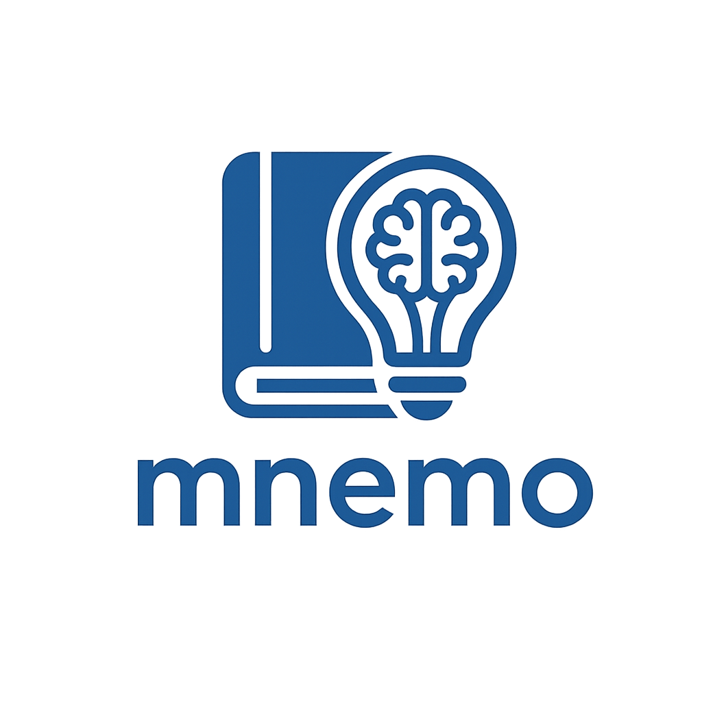

<p align="center">
  
</p>

[](LICENSE)
[](CHANGELOG.md)
[](https://www.python.org/)
[](CONTRIBUTING.md)

> *Knowledge that compounds.*

Named after [Mnemosyne](https://en.wikipedia.org/wiki/Mnemosyne), the Greek goddess of memory and mother of the Muses.

If this saves you time, [](https://github.com/craft-man/mnemo) helps others find it.

> [!WARNING]
> This plugin is in beta. Core skills run on Claude Code, OpenCode, Gemini CLI, Cursor, Codex, and any agentskills.io-compatible agent. Heavy workflows use native sub-agents when the host supports delegation, and otherwise fall back to inline execution. Session memory wiring and session-end reminders are host-dependent: mnemo uses the current tool's project memory file and hook/reminder system when available, and falls back to best-effort local instructions otherwise. Thanks for your patience! Contributions welcome.

Most AI tools re-derive answers from your raw files on every query. mnemo builds a persistent wiki instead: your agent reads your sources once, synthesizes structured pages, and cross-references them permanently. The longer you use it, the richer the graph gets.

Inspired by Karpathy's [LLM Wiki pattern](https://gist.github.com/karpathy/442a6bf555914893e9891c11519de94f).

[Why not just RAG?](#why-not-just-rag) · [What it does](#what-it-does) · [Installation](#installation) · [Quick start](#quick-start) · [Search backends](#search-backends) · [Typical workflow](#typical-workflow) · [Skills](#skills) · [Obsidian](#using-mnemo-with-obsidian) · [Contributing](#contributing)

---

## Why not just RAG?

RAG retrieves, but it doesn't remember. Every query starts from scratch: embed, search, read, answer, forget.

mnemo accumulates. Each ingest run extracts entities and concepts, links them bidirectionally, and updates existing pages with new citations. A concept page that starts with one source reference grows into a dense hub as more sources arrive. Queries hit a pre-synthesized graph, not raw documents.

The difference compounds over time. At 5 sources it feels similar. At 50, the wiki answers questions your sources never explicitly addressed.

Entity, concept, and synthesis pages also carry structured claims: each important assertion can point back to a source page and a short excerpt, with a status of `active`, `disputed`, or `superseded`.

---

## What it does

mnemo gives your agent a two-tier memory system:

- **Project knowledge base** (`.mnemo/<project-name>/`): sources, entities, concepts, syntheses, schema, and audit log for the current project
- **Global profile** (`~/.mnemo/`): persistent user profile and cross-project memory
- **Codebase graph runtime** (`graphify-out/`, optional): graphify's native code-structure artifacts for fast codebase orientation

The project tier is a taxonomy-based wiki:

```
.mnemo/
└── <project-name>/
    ├── raw/          ← drop your source files here (immutable input)
    ├── wiki/
    │   ├── activity/ ← session activity log per day
    │   ├── sources/  ← one synthesized page per ingested source
    │   ├── entities/ ← people, tools, projects, systems
    │   ├── concepts/ ← patterns, techniques, ideas
    │   ├── synthesis/← cross-source analyses and comparisons
    │   └── indexes/  ← index shards when the wiki grows large
    ├── index.md      ← categorized table of contents
    ├── log.md        ← audit trail
    ├── SESSION_BRIEF.md ← compact startup context for agents
    ├── SCHEMA.md     ← domain conventions (edit per project)
    └── config.json   ← search backend configuration
```

`graphify-out/` is intentionally separate from `.mnemo/`: graphify owns codebase analysis, cache, and structured graph artifacts; mnemo owns the knowledge base, profile, and durable notes.

mnemo exposes its skills as portable `SKILL.md` workflows for any [agentskills.io](https://agentskills.io)-compatible agent. No server required.

---

## Installation

**Requirements:** one compatible host agent.

- For Claude Code marketplace install: [Claude Code](https://claude.ai/code) CLI
- For other hosts: an [agentskills.io](https://agentskills.io)-compatible agent

### Claude Code marketplace (recommended)

```
/plugin marketplace add craft-man/mnemo
```

Once installed, mnemo is available in any project. No `--plugin-dir` needed.

### Other agents (Codex, Cursor, OpenCode…)

```bash
npx skills add craft-man/mnemo
```

### Manual (git clone)

```bash
git clone https://github.com/craft-man/mnemo
claude --plugin-dir ./mnemo
```

---

## Compatibility Matrix

This matrix describes current intended behavior by host.

| Host | Memory file | Invocation | Heavy workflow execution | Notes |
|---|---|---|---|---|
| Claude Code | Auto-loaded project memory file when supported | Slash commands + natural language | Native sub-agent when available, inline fallback otherwise | Can also wire a session-end reminder when the host supports local hooks |
| Codex | Auto-loaded project memory file when supported | Natural language, or host-specific skill invocation | Inline fallback by default, native delegation if the host exposes it | Prefers a host-supported project memory file over a best-effort fallback |
| Cursor | Auto-loaded project memory file when supported | Natural language, or host-specific skill invocation | Inline fallback by default, native delegation if the host exposes it | Prefers a host-supported project memory file over a best-effort fallback |
| OpenCode | Auto-loaded project memory file when supported | Natural language, or host-specific skill invocation | Inline fallback by default, native delegation if the host exposes it | Prefers a host-supported project memory file over a best-effort fallback |
| Gemini CLI | Auto-loaded project memory file when supported | Natural language, or host-specific skill invocation | Inline fallback by default, native delegation if the host exposes it | Prefers a host-supported project memory file over a best-effort fallback |
| Copilot | Best-effort project instructions unless auto-load is confirmed | Natural language/manual workflow | Inline/manual fallback | mnemo can write local instructions, but does not promise automatic loading across Copilot surfaces |
| Other agentskills.io hosts | Host-specific | Natural language or skill invocation, depending on host | Inline fallback baseline | If no project memory file is known to auto-load, mnemo can write a best-effort local instructions file |

### Interpretation

- `init`, `save`, `mine`, `log`, and `stats` do not depend on sub-agent support.
- `ingest`, `query`, and `lint` use workflow specs from `agents/`.
- If the host supports delegation clearly, mnemo may use sub-agents.
- If not, mnemo runs the same workflow inline in the main agent.

---

## Quick start

In any agent (Claude Code, Codex, Cursor, OpenCode, Gemini CLI…):

```
/mnemo:init
```

Without an agent, use the standalone bootstrap (Python 3.10+):

```bash
python3 scripts/init_mnemo.py
```

Both paths let you configure **qmd** for hybrid semantic search. Then drop files into `.mnemo/<project-name>/raw/` and:

```
/mnemo:ingest      # "ingest files in raw/"
/mnemo:query <term>
```

---

## Utility scripts

Deterministic operations are handled by Python scripts (3.10+, no external dependencies). Skills invoke them automatically as a fast path before falling back to LLM.

| Script | Purpose | CLI |
|---|---|---|
| `scripts/init_mnemo.py` | Bootstrap vault structure | `python3 scripts/init_mnemo.py` |
| `scripts/update_log.py` | Append entry to `log.md` | `python3 scripts/update_log.py --vault <path> --file <slug> --op <op>` |
| `scripts/update_index.py` | Regenerate `index.md` from frontmatter | `python3 scripts/update_index.py --vault <path> [--dry-run] [--json]` |
| `scripts/update_session_brief.py` | Regenerate compact startup context | `python3 scripts/update_session_brief.py --vault <path> [--summary <text>]` |
| `scripts/show_session_brief.py` | Print compact startup context without modifying files | `python3 scripts/show_session_brief.py --vault <path> [--code]` |
| `scripts/wiki_search.py` | BM25 search across wiki pages | `python3 scripts/wiki_search.py <mnemo_dir> <query>` |
| `scripts/wiki_stats.py` | Size metrics and scaling status | `python3 scripts/wiki_stats.py <mnemo_dir>` |
| `skills/lint/wiki_lint.py` | Structural audit of the wiki | `python3 skills/lint/wiki_lint.py <mnemo_dir>` |

---

## Search backends

By default mnemo uses a simple stdlib **BM25** fallback. It has no extra dependencies and works out of the box for small wikis.

For medium and large wikis, **[qmd](https://github.com/tobi/qmd)** is recommended. It provides local hybrid search (BM25 + vector embeddings), and both `/mnemo:init` and `python3 scripts/init_mnemo.py` offer to configure it. Once set up, `/mnemo:query` routes through qmd automatically.

**qmd requirements:** Node.js ≥ 22 or Bun ≥ 1.0, ~2 GB disk (models downloaded once on first use).

```bash
# with npm
npm install -g @tobilu/qmd
# or
bun install -g @tobilu/qmd
```

qmd is optional. BM25 remains available as fallback if qmd is unavailable or returns an error. `/mnemo:stats` reports the active backend and recommends qmd when a BM25 wiki grows large.

The active backend is stored in `.mnemo/<project-name>/config.json` under `search_backend` (`"bm25"` or `"qmd"`). Custom backends can be registered by adding a dispatch case to the query skill; see `skills/references/backends.md` for the interface spec.

---

## Typical workflow

Slash commands work in any agent. Natural language alternatives are shown in comments, so use whichever your agent prefers.

```
/mnemo:init                          # "initialize mnemo"; guides qmd, graphify, schema, and agent memory setup
/mnemo:context                       # "Charge le contexte mnemo minimal pour ce projet."
# drop files into .mnemo/<project-name>/raw/
/mnemo:ingest                        # "ingest files in raw/"
/mnemo:graphify                      # optional: map the codebase into graphify-out/
/mnemo:query database indexing       # "what does my wiki say about database indexing?"
/mnemo:mine                          # "remember this"; extract knowledge from current session
/mnemo:save B-tree vs Hash Index     # "save this as a wiki page titled B-tree vs Hash Index"
/mnemo:lint                          # "audit my wiki"
/mnemo:stats                         # "show wiki stats"
/mnemo:log                           # "show the audit log"; filter by op, date, or last N entries
```

No agent? Bootstrap with the standalone script:

```bash
python3 scripts/init_mnemo.py        # requires Python 3.10+
```

---

## Skills

### `/mnemo:init`

Bootstraps a new knowledge base. Run once per project; it warns if already initialized.

```
.mnemo/
└── <project-name>/
    ├── raw/          ← drop your source files here
    ├── wiki/
    │   ├── activity/
    │   ├── sources/
    │   ├── entities/
    │   ├── concepts/
    │   ├── synthesis/
    │   └── indexes/
    ├── index.md
    ├── log.md        ← ingest and graphify audit trail
    ├── SESSION_BRIEF.md ← compact startup context
    ├── SCHEMA.md     ← starter taxonomy, ready to edit
    └── config.json   ← search backend (`bm25` or `qmd`)
```

`log.md` records every ingested file, including filename and ISO timestamp. Before processing anything, `/mnemo:ingest` checks this log and skips files already present. To force a re-ingest, remove the entry from `log.md`.

`/mnemo:init` also:

- offers to run `/mnemo:schema` immediately
- ensures your global profile exists via `/mnemo:onboard`
- offers to enable **qmd** for hybrid semantic search
- generates `SESSION_BRIEF.md` for compact startup context
- offers to write project memory instructions into a host-supported auto-loaded memory file when available
- offers to configure a session-end `/mnemo:mine` reminder when the host supports local hooks or reminders
- offers to run `/mnemo:graphify` right away

Future sessions should read `SESSION_BRIEF.md` first. When graphify is enabled, they read `graphify-out/GRAPH_REPORT.md` only for codebase-structure tasks.

### `/mnemo:context`

Loads the minimal mnemo startup context manually when an agent did not auto-load project instructions before the first prompt.

It is read-only and loads only:

- `.mnemo/<project-name>/SESSION_BRIEF.md`
- `~/.mnemo/wiki/entities/person-user.md` if present
- `graphify-out/GRAPH_REPORT.md` only with `/mnemo:context --code`

It never reads the whole wiki and never regenerates `SESSION_BRIEF.md`. If the brief is missing or stale, it reports the regeneration command:

```bash
python3 scripts/update_session_brief.py --vault .mnemo/<project-name>
```

Without an agent, use:

```bash
python3 scripts/show_session_brief.py --vault .mnemo/<project-name> [--code]
```

### Startup context model

mnemo keeps startup context compact:

1. Read `.mnemo/<project-name>/SESSION_BRIEF.md` if present.
2. Read `graphify-out/GRAPH_REPORT.md` only when the task concerns code structure.
3. Use `/mnemo:query <term>` for focused retrieval.

Do not load the whole wiki at session startup. `index.md` remains the catalog; `SESSION_BRIEF.md` is the operational summary.
If startup auto-load did not happen, run `/mnemo:context` or say "Charge le contexte mnemo minimal pour ce projet."

### `/mnemo:onboard`

Creates or updates your global user profile at `~/.mnemo/wiki/entities/person-user.md`. It runs automatically on first `/mnemo:init` and is skipped silently if a profile already exists. Run directly to update it.

A short interview covers your role (solo dev, team lead, researcher…), technical level, preferred language for notes and responses, main domains of interest, knowledge base goal, and response style preference. Answers are inferred from the conversation where possible (e.g. language), so you only confirm rather than type them.

The profile persists across all projects and lets mnemo tailor its responses to your context without re-asking every session.

### `/mnemo:schema`

Builds or revises `.mnemo/<project-name>/SCHEMA.md`, the taxonomy that tells `/mnemo:ingest` how to classify what it finds. No form to fill out: the skill asks questions, proposes a draft, and you refine it. If files are already in `raw/`, it reads them first and brings concrete suggestions rather than a blank slate.

Covers entity types (people, tools, projects, systems), concept categories (techniques, patterns, principles), tagging conventions, and relationship hints. Nothing is written without your explicit confirmation.

Run it any time, not just at init. This is useful when the domain evolves or the initial taxonomy turns out too coarse.

### `/mnemo:ingest`

Processes all pending files from `raw/` via LLM synthesis.

- Synthesizes a summary, key points, and excerpts without copy-pasting raw text
- Extracts entities and concepts, creating dedicated pages for each
- Writes bidirectional wikilinks between source, entity, and concept pages
- Enriches up to 15 related existing pages per ingest run
- Enforces `source:` citation in frontmatter, so provenance is never silently lost
- Writes structured `## Claims` for new entity/concept pages, with `Claim`, `Evidence`, and `Status`
- Checks page size; warns at 400 lines, splits at 800
- Detects contradictions with existing claims and offers `update / keep both / disputed / history / skip`. The `history` option marks an entity as superseded: it adds `superseded_by:` to the old page's frontmatter, appends a `## History` entry, and adds `supersedes:` to the new page

### `/mnemo:query <term>`

Searches the knowledge base using BM25 or hybrid semantic search (qmd, if configured at init).

Supports modifiers: `category:concepts`, `tag:redis`, `since:2026-01-01`, `backlinks:<title>`, `top-linked`. Falls back to the global knowledge base if local returns no results.

### `/mnemo:lint`

Audits the knowledge base and proposes fixes for:

| Issue | Meaning |
|---|---|
| `orphan` | Wiki page not referenced in index |
| `broken_link` | Index entry pointing to a missing file |
| `unprocessed` | File in `raw/` not yet ingested |
| `missing_frontmatter` | Wiki page without YAML frontmatter |
| `missing_source_citation` | Source page without `source:` field |
| `oversized` | Wiki page exceeding 800 lines |
| `no_inbound_links` | Entity or concept with no wikilinks pointing to it |
| `stale_claim` | Temporal language that may be outdated |
| `gap_page` | Term in 3+ sources but no dedicated page |
| `superseded_without_history` | Entity/concept with `superseded_by:` or `supersedes:` but no `## History` section |
| `missing_claims_section` | Entity, concept, or synthesis page without `## Claims` |
| `claim_without_evidence` | Claim bullet missing an `Evidence` field |
| `claim_without_status` | Claim bullet missing a `Status` field |
| `invalid_claim_status` | Claim status is not `active`, `disputed`, or `superseded` |

Every proposed fix requires explicit approval before being applied.

### `/mnemo:save <title>`

Saves generated content (summaries, comparisons, analyses) as a permanent wiki page with YAML frontmatter, routed to the correct category and indexed automatically. Saved entity, concept, and synthesis pages include structured claims when they contain verifiable assertions.

### `/mnemo:mine`

Scans the current session for knowledge worth persisting: decisions, new entities, concepts, and conclusions. Presents a numbered candidate list; approved items are routed to `/mnemo:save`.

Triggered explicitly (`/mnemo:mine`) or by intent, either when the user expresses a desire to save something ("remember this", "note that", "important") or when the agent detects high-value signals ("we decided", "in conclusion", "key insight"), in any language.

### `/mnemo:graphify`

Maps the project codebase into a knowledge graph using [graphify](https://github.com/safishamsi/graphify). Requires graphify installed (`pip install graphifyy && graphify install`) and mnemo initialized.

- Runs `graphify .` on the project root (respects `.graphifyignore`; `.mnemo/` is always excluded)
- Treats `graphify-out/` as graphify's canonical runtime directory
- Keeps `graphify-out/graph.json`, `graphify-out/GRAPH_REPORT.md`, and `graphify-out/cache/` in place
- Writes only lightweight mnemo integration pages:
  - `wiki/synthesis/codebase-graph-report.md`
  - `wiki/synthesis/codebase-graph-status.md`
- Does not convert graph nodes into mnemo entity/concept pages
- Does not copy `graph.json` or `cache/` into `.mnemo/`

The point: your agent starts with `graphify-out/GRAPH_REPORT.md` for codebase structure, uses `graphify-out/graph.json` for focused follow-up questions, and avoids rescanning the entire repo when graphify's runtime is already fresh.

### `/mnemo:stats`

Displays page counts per category, total lines, top 5 largest pages, and index scaling status.
Also reports the active search backend and recommends qmd for large BM25 wikis.

### `/mnemo:log`

Queries `log.md` in natural language. Displays ingest, skipped, generated, and lint entries as a sorted markdown table. Supports filtering by operation type, recency (`last N`), and date range (`since YYYY-MM-DD` or `since Monday`). Read-only and never writes to `log.md`.

---

## Agents

For heavy-duty operations, mnemo uses dedicated workflow specs. When the host supports delegation, mnemo dispatches them to sub-agents in an isolated context. When it does not, mnemo runs the same workflow inline in the main agent.

| Workflow | Reasoning Hint | Used by | Key Behaviors |
|---|---|---|---|
| `mnemo-ingestor` | `heavy` | `/mnemo:ingest` | Discuss before write; proposes TL;DR + planned pages before writing |
| `mnemo-archivist` | `balanced` | `/mnemo:query` | Adaptive formatting + offers to file back after each substantial response |
| `mnemo-linter` | `heavy` | `/mnemo:lint` | Mechanical audit + graph (hubs, sinks, components) + semantics |

Workflows are defined in the `agents/` directory at the root of the plugin. Each file is self-contained and can be read independently as a reference specification. Dispatch behavior is selected by host adapters in `skills/dispatch/`, with inline fallback when no native sub-agent mechanism exists.

---

## Using mnemo with Obsidian

mnemo's wiki format works directly in Obsidian. Open `.mnemo/<project-name>/` as the vault root (or `~/.mnemo/` for the global tier). This keeps both `raw/` and `wiki/` visible in the same vault while displaying the project name in Obsidian. Wikilinks resolve in the graph view, YAML frontmatter shows up in the properties panel, and the bidirectional links from `/mnemo:ingest` appear in the backlinks panel without any setup.

### Obsidian Web Clipper

[Obsidian Web Clipper](https://obsidian.md/clipper) lets you clip web pages and articles directly from your browser. Configure it to save clips into `.mnemo/<project-name>/raw/`, then run `/mnemo:ingest`. mnemo synthesizes each clip into a structured wiki page, extracts entities and concepts, and links it into the graph.

---

## Contributing

Each skill is a `SKILL.md` file. Edit it, reload, test. See [CONTRIBUTING.md](CONTRIBUTING.md) for the full guide.

---

## License

MIT
